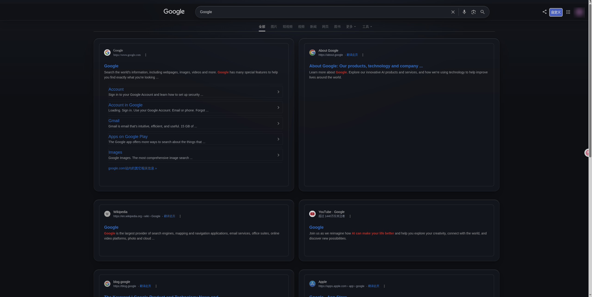
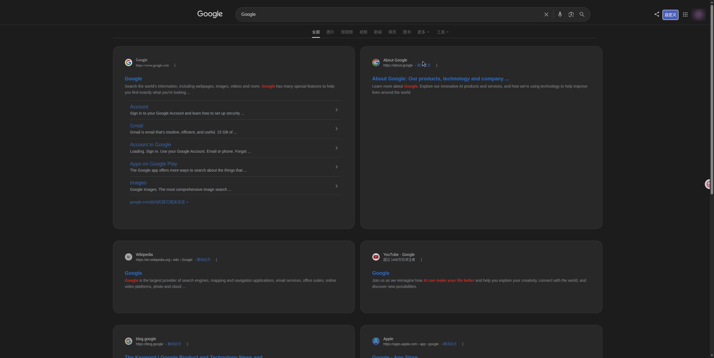
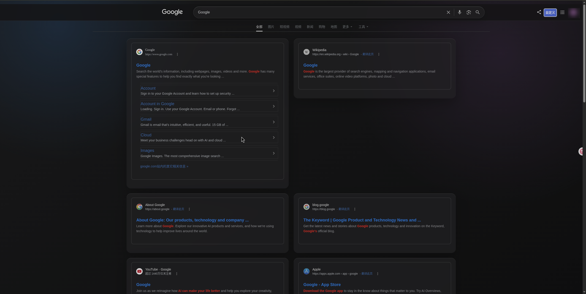
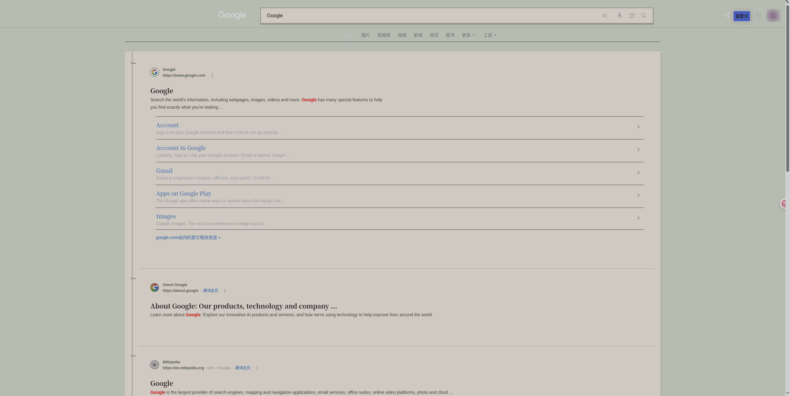
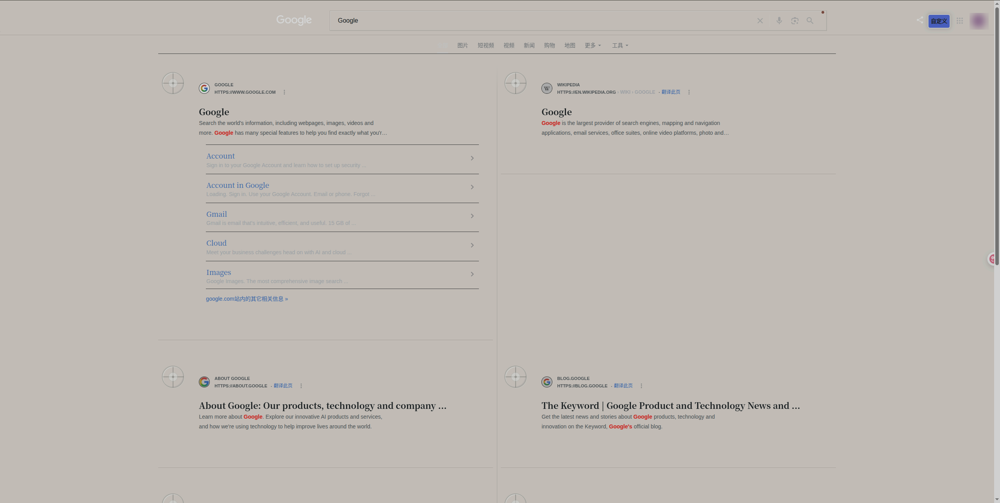
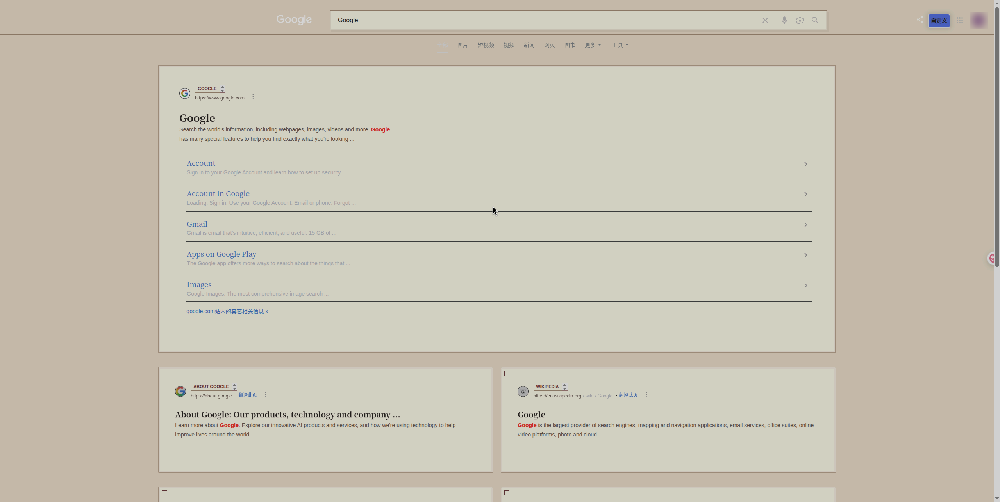

# AC Baidu Themes

适用于 AC-Baidu 自定义样式的搜索页面主题。仓库包含 6 套独立 LESS 样式，每套均可单独使用。

## 主题

| 主题 | 样式文件 | Raw 链接 | 预览 |
| --- | --- | --- | --- |
| Apple Glass | [apple-glass.less](./apple-glass.less) | [Raw](https://raw.githubusercontent.com/psympsym/ac-baidu-themes/master/apple-glass.less) | [预览](./apple-glass.png) |
| Apple Soft Dark | [apple-soft-dark.less](./apple-soft-dark.less) | [Raw](https://raw.githubusercontent.com/psympsym/ac-baidu-themes/master/apple-soft-dark.less) | [预览](./apple-soft-dark.png) |
| Google Glass | [google-glass.less](./google-glass.less) | [Raw](https://raw.githubusercontent.com/psympsym/ac-baidu-themes/master/google-glass.less) | [预览](./google-glass.png) |
| Waza Book Spine | [waza-book-spine.less](./waza-book-spine.less) | [Raw](https://raw.githubusercontent.com/psympsym/ac-baidu-themes/master/waza-book-spine.less) | [预览](./waza-book-spine.png) |
| Waza Embossed Index | [waza-embossed-index.less](./waza-embossed-index.less) | [Raw](https://raw.githubusercontent.com/psympsym/ac-baidu-themes/master/waza-embossed-index.less) | [预览](./waza-embossed-index.png) |
| Waza Letterpress | [waza-letterpress.less](./waza-letterpress.less) | [Raw](https://raw.githubusercontent.com/psympsym/ac-baidu-themes/master/waza-letterpress.less) | [预览](./waza-letterpress.png) |

## 使用

在支持远程 LESS 的自定义主题入口中填写对应 Raw 链接，或复制 LESS 文件内容到自定义样式编辑器。

## 预览

### Apple Glass

明亮通透的玻璃界面，使用柔和高光、半透明表面与克制阴影，适合偏好现代 Apple 风格的用户。

### Apple Soft Dark

低对比度深色主题，以柔和层级和舒适文字亮度减少长时间搜索带来的视觉疲劳。

### Google Glass

深色玻璃主题，将搜索结果组织为宽屏双栏卡片，保留 Google 蓝色链接与清晰的内容层级。

### Waza Book Spine

以书籍目录和装订结构为灵感，通过连续书脊线、装订节点和宋体排版建立安静的阅读节奏。

### Waza Embossed Index

以档案索引为灵感，使用冷灰纸面、双栏网格和盲压印章，呈现严谨的资料库气质。

### Waza Letterpress

以活字印刷校样为灵感，使用方形纸签、定位角和酒红色套印标记，突出主次结果关系。

